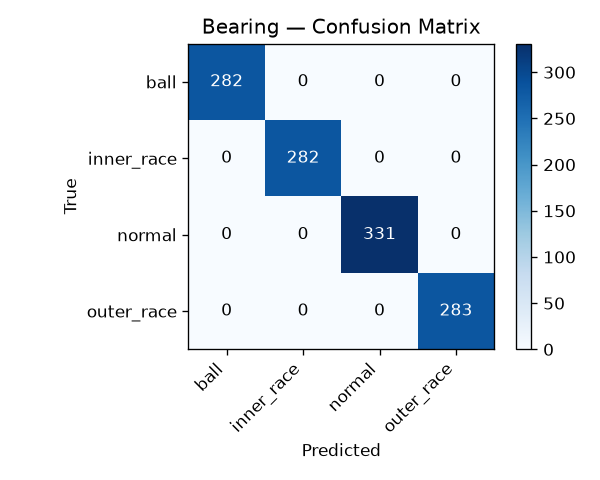
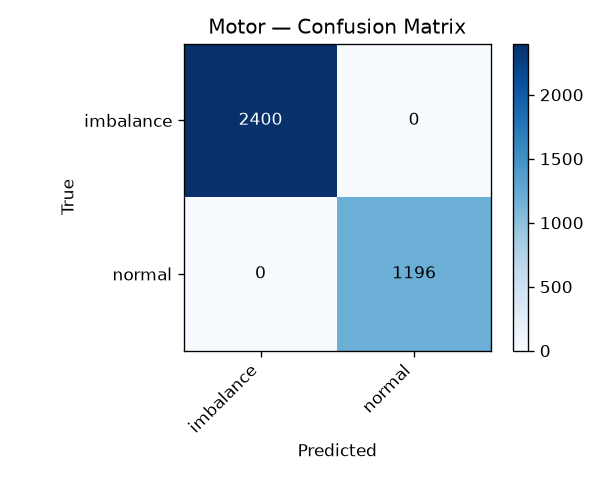
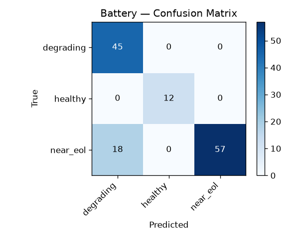

# DriveGuard — Evaluation Report


## Summary

| Subsystem | Classes | Val samples | Accuracy | Macro F1 | Latency (CPU, ms) |
|---|---|---|---|---|---|
| Bearing | 4 | 1178 | 1.0000 | 1.0000 | 6.71 |
| Motor | 2 | 3596 | 1.0000 | 1.0000 | 6.86 |
| Battery | 3 | 132 | 0.8636 | 0.8990 | 4.62 |

## Bearing

- Validation samples: 1178
- Classes: ball, inner_race, normal, outer_race
- Accuracy: 1.0000
- Macro F1: 1.0000
- Avg inference latency (CPU): 6.71 ms



```
              precision    recall  f1-score   support

        ball       1.00      1.00      1.00       282
  inner_race       1.00      1.00      1.00       282
      normal       1.00      1.00      1.00       331
  outer_race       1.00      1.00      1.00       283

    accuracy                           1.00      1178
   macro avg       1.00      1.00      1.00      1178
weighted avg       1.00      1.00      1.00      1178

```

## Motor

- Validation samples: 3596
- Classes: imbalance, normal
- Accuracy: 1.0000
- Macro F1: 1.0000
- Avg inference latency (CPU): 6.86 ms



```
              precision    recall  f1-score   support

   imbalance       1.00      1.00      1.00      2400
      normal       1.00      1.00      1.00      1196

    accuracy                           1.00      3596
   macro avg       1.00      1.00      1.00      3596
weighted avg       1.00      1.00      1.00      3596

```

## Battery

- Validation samples: 132
- Classes: degrading, healthy, near_eol
- Accuracy: 0.8636
- Macro F1: 0.8990
- Avg inference latency (CPU): 4.62 ms



```
              precision    recall  f1-score   support

   degrading       0.71      1.00      0.83        45
     healthy       1.00      1.00      1.00        12
    near_eol       1.00      0.76      0.86        75

    accuracy                           0.86       132
   macro avg       0.90      0.92      0.90       132
weighted avg       0.90      0.86      0.87       132

```